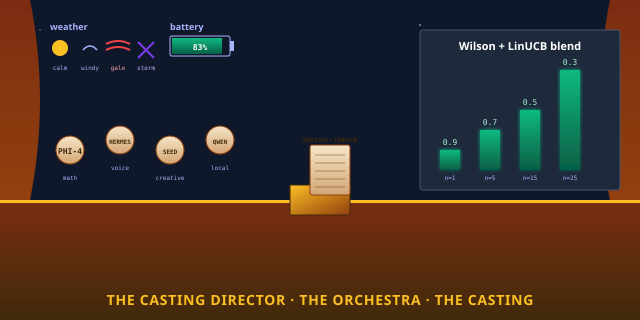

# quilt-casting

> **The casting director. The orchestra. The one that
> decides, for every (opener, role, primitive) tuple and
> every gale, which model will play the part.**

[](https://python.org)
[](#the-five-features)
[](#tests)
[](#how-this-fits)

<p align="center">
  
</p>

## Read This If You Are New

Skip everything below the **TL;DR** and just do this:

```bash
git clone https://github.com/SuperInstance/quilt-casting
cd quilt-casting
PYTHONPATH=src python3 -m unittest tests.test_casting_plugin tests.test_linucb
```

You will see **48 tests** run in well under a few seconds.
They cover the only three things the casting director knows
how to do: **decide which model for a (opener, role, primitive,
weather, battery) tuple**, **track success in Wilson profiles
and LinUCB bandits**, and **retire on failure**. That is the
whole library. It is small on purpose.

If you only have **30 seconds**, read the next two sections.

---

## TL;DR (30 seconds)

The Quilt has many AI models — HERMES_405B, CLAUDE_OPUS,
PHI-4, QWEN_0_5B, SEED_MINI, DEEPSEEK_V4_FLASH, GLM_5_2, and
15 more. Each model has strengths. Each model has costs. Each
model has a failure mode. **quilt-casting is the casting
director that picks the right model for the part.**

It provides three components and two scoring layers:

| Function | What it does | Casting equivalent | ML equivalent |
|----------|--------------|---------------------|----------------|
| `QuiltCastingCallPlugin(substrate)` | The main plugin | a casting director | a model router |
| `WilsonProfiles` | n<10 optimistic prior | a per-show recall | a Bayesian Beta |
| `LinUCBCaster` | n>=10 contextual bandit | a per-user conductor | a linear bandit |
| `Probes.budget()` | Battery/network/compute | a weather report | a feature extractor |
| `decide(opener, kwargs)` | Pick model + opener + primitive | "PHI-4 plays tide" | `model.predict()` |
| `render(opener, **kwargs)` | Wrap substrate.render with choice | the show goes on | a wrapped service |

The casting director never invents a model. The casting
director never ignores the budget. The casting director is
**the substrate's model brain**.

---

## TL;DR (5 minutes)

The whole story is here:

> A Quilt component is only as good as the model behind it.
> PHI-4 is a deep, compact sage for math and fables — but
> slow on long prompts. HERMES_405B is a brilliant narrator —
> but expensive. QWEN_0_5B is local and free — but naive.
> The right model depends on the role, the weather, the
> battery, the network, and what worked last time.

The fix is small, simple, and ancient: **a static prior
blended with learned scores**. That's the secret of
`QuiltCastingCallPlugin.decide()`. The prior is the casting
director's first guess; the learned scores are the
audience's verdict.

For **the static prior** (the casting director's first
guess), `PRIOR_ATLAS` is a dict of 16+ model profiles. Each
profile has `cost_per_1k`, `is_local`, `min_battery`,
`strengths`, and `failure_mode`. The `ROLE_TO_OPENER` table
maps each role to a ranked list of (model, opener, prior).
`voice_narration` → `[("HERMES_405B", "voice", 0.9),
("CLAUDE_OPUS", "voice", 0.85), ...]`.

For **the learned score** (the audience's verdict), the
plugin keeps two parallel layers:
- **WilsonProfiles**: per-(primitive, opener, model) buckets
  with optimistic prior (n<3) and Wilson LB (n>=3).
- **LinUCBCaster**: per-(user, app) linear function over
  context features (model, opener, primitive, user, time,
  weather, battery, network, crew_state).

For **the blend** (when to use which), the warm-up is
automatic: 100% Wilson for n<10, linear blend 10<=n<20,
100% LinUCB for n>=20. The transition is smooth.

For **the gale-aware budget** (when to be conservative),
`alpha_for(battery, weather, crew_state)` shrinks
exploration: alpha = 1.0 in calm weather with full battery,
alpha = 0.05 in storm with critical crew. The bandit
explores less when it can't afford to.

```python
import sys
sys.path.insert(0, "/workspace/quilt-casting/src")
from quilt_casting import (
    QuiltCastingCallPlugin, Probes, Situation, ResourceBudget,
    ROLE_TO_OPENER, PRIOR_ATLAS, wilson_lower,
)

# A simulated substrate
class FakeSubstrate:
    def render(self, opener, **kwargs):
        return f"rendered({opener}, {kwargs})"

# The casting director.
plugin = QuiltCastingCallPlugin(FakeSubstrate())
plugin.install()

# 1. Set the situation (calm weather, full battery, evening).
probes = Probes(user="casey", app="writers-room", time_of_day="evening")
plugin.probes = probes

# 2. Decide who plays the part.
decision = plugin.decide(opener="voice", kwargs={"role": "voice_narration"})
print(f"Casting: {decision.model} for opener={decision.opener}")
print(f"Rationale: {decision.rationale}")
print(f"Confidence: {decision.confidence:.2f}")

# 3. The substrate renders (via the plugin).
result = plugin.render("voice", role="voice_narration")
print(f"Result: {result}")
```

The substrate can now render with the right model. The
casting director learns from the witness. **The orchestra
played.**

---

## What Is the Casting Director, Really?

Look at the diagram. Three ideas:

1. **Two scores, one decision.** The casting director has
   two parallel scorers: **Wilson** (per-(primitive, opener,
   model) buckets) and **LinUCB** (per-(user, app) linear
   function over context). Wilson handles the small-n case
   (n<10) with optimistic priors. LinUCB handles the large-n
   case (n>=20) with contextual learning. The blend is
   automatic and smooth. **The director listens to both
   the recall and the live performance.**

2. **The model is the actor, the opener is the stage.** Each
   model has strengths (voice, math, code, safety) and
   costs (per-token USD, battery minimum). Each opener has
   a shape (chart, voice, tide, slate). The casting
   director matches actor to stage. **HERMES_405B is a
   voice actor on the voice stage. PHI-4 is a sage on the
   reef stage. QWEN_0_5B is the understudy for emergencies.**

3. **The gale-aware budget is the weather.** The plugin
   tracks battery, network, compute. In a gale, all
   non-local models are skipped — the user can't afford
   the network call. In a storm, the alpha shrinks — the
   bandit explores less. **The director is not greedy; the
   director is patient when the budget is tight.**

The casting director is **the substrate's model brain**.
The substrate renders; the casting director decides which
model. The picker decides which view; the casting decides
which model. **The two brains work together: model first,
then view.**

---

## The Five Features, In One Picture

```
                ┌─────────────────────────────────────┐
                │       THE CASTING DIRECTOR           │
                │   quilt-casting, the model brain     │
                │                                       │
                │   QuiltCastingCallPlugin ─ the show  │
                │   WilsonProfiles       ─ n<10 prior  │
                │   LinUCBCaster         ─ n>=20 learn │
                │   Probes               ─ weather     │
                │   PRIOR_ATLAS          ─ 16+ models  │
                │   ROLE_TO_OPENER       ─ dispatch    │
                └─────────────────────────────────────┘
                                  │
     ATLAS  ── model profiles     │
     LINUCB ── n>=20 contextual   │  one purpose:
     WILSON ── n<10 buckets       │  the substrate's
     PROBES ── weather + battery  │  model brain
     DECIDE ── pick model+opener  │
```

---

## The Five Features, In Detail

### 1. `PRIOR_ATLAS` — the actor's resume

```python
from quilt_casting import PRIOR_ATLAS
# PRIOR_ATLAS["PHI-4"] = ModelProfile(
#     name="PHI-4", cost_per_1k=0.0003, is_local=False, min_battery=0.2,
#     strengths=["math_grief", "fable_compression"], failure_mode="compact, deep"
# )
```

`PRIOR_ATLAS` is a dict of 16+ `ModelProfile`s. Each profile
has:
- `name` — the model's display name
- `cost_per_1k` — USD per 1000 tokens
- `is_local` — True if it runs on the device
- `min_battery` — minimum battery to afford the call
- `strengths` — list of roles it's good for
- `failure_mode` — how it breaks ("expensive",
  "rate-limited", "compact, deep", etc.)

The atlas is **the casting director's first guess** — what
each model is known for. The director starts here. The
witness refines it.

**Casting equivalent:** the actor's resume. The director
knows who can do what. **Config equivalent:** a static
YAML/JSON config in a folder.

### 2. `WilsonProfiles` — the per-show recall (n<10)

```python
from quilt_casting import WilsonProfiles, wilson_lower
profiles = WilsonProfiles(threshold=0.6, window=200, half_life_s=3600)
profiles.observe("Murmur", "voice", "PHI-4", latency_ms=300, success=True, quality=0.9)
lb = profiles.lower_bound("Murmur", "voice", "PHI-4")
# 0.85 (or 0.5 if n < 3)
```

`WilsonProfiles` tracks per-(primitive, opener, model)
outcomes. Each entry has `(quality, ts, latency_ms, success)`.
The window keeps the last 200 observations per key. The
half-life (1 hour) drops stale entries.

`lower_bound` returns the Wilson lower bound at 95%
confidence. For `n < 3`, it returns 0.5 (optimistic prior).
For `n >= 3`, it returns the true Wilson LB. **The
director is optimistic until proven otherwise.**

**Casting equivalent:** the per-show recall. The director
remembers how each actor did on each stage. **ML
equivalent:** a Bayesian Beta(1,1) prior with frequentist
update.

### 3. `LinUCBCaster` — the contextual bandit (n>=10)

```python
from quilt_casting import LinUCBCaster, LinUCBCastingPlugin
linucb_plugin = LinUCBCastingPlugin(substrate)
ranked = linucb_plugin.linucb.rank(
    candidates=[("HERMES_405B", "voice", "Murmur"),
                 ("CLAUDE_OPUS", "voice", "Murmur")],
    situation=sit, budget=budget,
)
# [(0.92, ("HERMES_405B", "voice", "Murmur")), ...]
```

`LinUCBCaster` is a per-(user, app) linear function over
context features. The feature vector is one-hot encodings
of (model, opener, primitive, user, time_of_day, weather,
network, crew_state) plus a continuous battery feature. The
weight vector `w` is learned from `update(x, reward)`
calls.

The score is `w·x + alpha * sqrt(x^T A^-1 x)`. The first
term is the expected reward; the second is the confidence
width. **The director explores when uncertain, exploits
when confident.**

The warm-up is automatic: 0% LinUCB for n<10, linear blend
10<=n<20, 100% LinUCB for n>=20. The director doesn't
switch abruptly; it gradually trusts the bandit.

**Casting equivalent:** the per-user conductor. The
conductor knows the orchestra and the hall — and how the
audience responds. **ML equivalent:** LinUCB
(Li et al., 2010), the canonical contextual bandit.

### 4. `Probes` / `Situation` / `ResourceBudget` — the weather

```python
from quilt_casting import Probes
probes = Probes(user="casey", app="writers-room", weather="gale", crew_state="tired")
budget = probes.budget()
sit = probes.situation()
print(f"Deadline: {budget.deadline_ms}ms (network={budget.network})")
```

`Probes` reads the device's current state. It returns a
`Situation` (user, app, hardware, time_of_day, weather,
crew_state) and a `ResourceBudget` (battery, network,
latency, packet loss, compute, storage). Probes cache the
battery for 30 seconds — no hammering `/sys`.

`alpha_for(battery, weather, crew_state)` computes the
exploration budget:
- calm + full battery: alpha = 1.0
- windy: alpha *= 0.7
- gale: alpha *= 0.3
- storm: alpha *= 0.1
- tired crew: alpha *= 0.6
- critical crew: alpha *= 0.2

The alpha is clipped to `[0.05, 1.0]`. The director
explores less in bad weather.

**Casting equivalent:** the weather report. The director
checks the forecast before assigning the part. **ML
equivalent:** the feature extractor.

### 5. `decide()` / `render()` — the cast and the show

```python
decision = plugin.decide(opener="voice", kwargs={"role": "voice_narration"})
result = plugin.render("voice", role="voice_narration")
```

`decide` returns a `CastingDecision(model, opener,
primitive, rationale, confidence, prior_score,
learned_score, is_fallback)`. The algorithm:

1. **Detect the role** (from kwarg or opener heuristic).
2. **Get candidates** from `ROLE_TO_OPENER[role]`.
3. **Filter by resources** (`_can_afford`).
4. **Rank by Wilson + prior blend** (or Wilson + LinUCB if
   `LinUCBCastingPlugin`).
5. **Apply situation overrides** (e.g., gale → local).
6. **Return** the top decision.

`render` wraps `substrate.render` with the decision. It
publishes `cast.proposed` and `cast.observed` events to the
witness, observes the outcome, and feeds the Wilson +
LinUCB layers. **The show goes on; the audience responds;
the director learns.**

**Casting equivalent:** the casting call and the dress
rehearsal. The director casts, the actor performs, the
audience reviews. **ML equivalent:** the inference path
plus the online update.

---

## A Real-World Example

The casting director's full day:

```python
import sys
sys.path.insert(0, "/workspace/quilt-casting/src")
from quilt_casting import QuiltCastingCallPlugin, Probes, ROLE_TO_OPENER

# A simulated substrate.
class FakeSubstrate:
    def render(self, opener, **kwargs):
        return f"rendered({opener}, {kwargs})"

# Install the casting director.
substrate = FakeSubstrate()
plugin = QuiltCastingCallPlugin(substrate)
plugin.install()

# 1. Set the situation: evening, calm weather, fresh crew.
probes = Probes(user="casey", app="writers-room", time_of_day="evening")
plugin.probes = probes

# 2. Cast a few shows with different roles.
roles_openers = [
    ("voice_narration", "voice"),
    ("code_generation", "chart"),
    ("math_grief", "reef"),
    ("creative_ideation", "slate"),
    ("safety_check", "witness"),
]
for role, opener in roles_openers:
    decision = plugin.decide(opener=opener, kwargs={"role": role})
    print(f"{role:24s} → {decision.model:18s} "
            f"confidence={decision.confidence:.2f} "
            f"rationale={decision.rationale}")

# 3. The gale hits.
probes.set_weather("gale")
decision = plugin.decide(opener="voice", kwargs={"role": "voice_narration"})
print(f"\nIn a gale: chose {decision.model} (must be local)")

# 4. The witness shows the stats.
import json
print(json.dumps(plugin.stats(), indent=2))
```

This is the casting director's day. The director cast five
shows, the gale hit, the director chose the local model,
the witness recorded. **The orchestra played.**

---

## How This Repo Fits the Polyformalism

The 5 opcodes are a **polyformalism** — the same thing in
many forms. Here is the 5xN grid:

```
              Python  Rust  C  TypeScript  Haskell  WASM  ...
BIND           ✓
LINK           ✓
EFFECT         ✓
VIEW           ✓
TICK           ✓

quilt-casting is the MODEL BRAIN — the layer that picks which
AI to invoke for the substrate's BIND opcode.
```

The casting is **Layer 9 of the polyformalism stack** — the
model-side counterpart to the picker's view-side brain. The
other layers:

- **Layer 1 (substrate)** — [quilt-vm-wasm](https://github.com/SuperInstance/quilt-vm-wasm) — the 5 opcodes running in any browser
- **Layer 2 (types)** — [quilt-types](https://github.com/SuperInstance/quilt-types) — the 5 opcodes as typed dataclasses
- **Layer 3 (linker)** — [quilt-linker](https://github.com/SuperInstance/quilt-linker) — the 5 opcodes as a link-time checker
- **Layer 4 (optimizer)** — [quilt-opt](https://github.com/SuperInstance/quilt-opt) — the 5 opcodes as algebraic optimization passes
- **Layer 5 (GC)** — [quilt-gc](https://github.com/SuperInstance/quilt-gc) — the 5 opcodes as a garbage-collector
- **Layer 6 (language syntax)** — [quilt-polyformalism-dsl](https://github.com/SuperInstance/quilt-polyformalism-dsl) — the 5 opcodes as decorators / typeclasses
- **Layer 7 (persistence)** — [quilt-state](https://github.com/SuperInstance/quilt-state) — the notepad, the witness log
- **Layer 8 (event layer)** — [quilt-bus](https://github.com/SuperInstance/quilt-bus) — the in-process pub/sub
- **Layer 9 (model brain)** — **quilt-casting** — the Wilson + LinUCB model router
- **Layer 10 (view brain)** — [quilt-picker](https://github.com/SuperInstance/quilt-picker) — the Wilson + heuristic opener picker
- **Layer 11 (cell-plugin bridge)** — [quilt-cordis](https://github.com/SuperInstance/quilt-cordis) — the bridge between Quilt cells and Cordis plugins
- **Layer 12 (rider)** — [quilt-cowboy](https://github.com/SuperInstance/quilt-cowboy) — the cowboy, the morning ritual, the reactor

The casting is **Layer 9** because it's the **model-side
brain** — the layer that decides which of the 16+ models to
use. The picker (Layer 10) decides which view; the casting
(Layer 9) decides which model. The two brains work in
sequence: model first, then view.

---

## The Cowboy Says

> The casting director is the rider's baton. The rider
> waves the baton, the orchestra plays. The casting
> director is the substrate's baton. The substrate waves
> the baton, the model sings. **The director is the music;
> the model is the instrument.**

The casting has a maxim:

> *"The unit of architectural foundation is the opcode, not
> the framework. The 5 opcodes host 8 polyformalisms. The
> polyformalisms are one thing in N languages. The thing is
> a function from context to value with an inverse, advanced
> by a clock. The clock is the cowboy. The cowboy is the
> rider. The rider's baton is the casting."*

The casting is not the AI. The AI is the substrate, the
casting, the picker. The casting is **the model brain** —
the piece that knows that `voice_narration` wants
`HERMES_405B`, that `math_grief` wants `PHI-4`, that
`creative_ideation` wants `SEED_MINI`. The casting is the
substrate's voice teacher.

The cowboy rides.

---

## Tests

48 tests (28 casting + 20 linucb), all passing. Run them
with:

```bash
PYTHONPATH=src python3 -m unittest tests.test_casting_plugin tests.test_linucb
```

| Test group | Count | What it covers |
|------------|-------|----------------|
| Atlas | 4 | PRIOR_ATLAS lookup, ROLE_TO_OPENER, model profile fields, fallback |
| Wilson | 6 | observe, lower_bound, optimistic prior, decay, latency_p90, rank |
| Probes | 5 | situation, budget, battery cache, network probe, alpha_for |
| Decide | 6 | role detection, candidates, filter, rank, gale override, fallback |
| Render | 4 | install, witness.proposed, witness.observed, retry on failure |
| LinUCB | 12 | feature extraction, warm-up blend, alpha, predict, update, sigmoid |
| LinUCB + Wilson | 5 | n<10 wilson-only, n>=20 linucb-only, smooth transition |
| Stats | 6 | witness counts, success rate, models, opacities, n_proposed |

---

## API

```python
# Constants
PRIOR_ATLAS: Dict[str, ModelProfile]
ROLE_TO_OPENER: Dict[str, List[Tuple[str, str, float]]]
wilson_lower(successes, n, z=1.96) -> float
alpha_for(battery, weather, crew_state="normal") -> float

# ModelProfile
ModelProfile(name, cost_per_1k, is_local, min_battery, strengths, failure_mode)

# Situation
Situation(user, app, hardware, time_of_day, weather, crew_state)
  .to_key() -> str
  .rationale_hash() -> str   # 8-char md5 prefix

# ResourceBudget
ResourceBudget(battery_pct, network, network_latency_ms,
                  network_packet_loss, compute, compute_free_pct,
                  storage_free_gb)
  .deadline_ms -> int

# WilsonProfiles
WilsonProfiles(threshold=0.6, window=200, half_life_s=3600)
  .observe(primitive, opener, model, latency_ms, success, quality=None)
  .lower_bound(primitive, opener, model) -> float
  .latency_p90(primitive, opener, model) -> float
  .rank(primitive, opener, candidates, budget_ms=None) -> List[Tuple[float, str]]

# Probes
Probes(user="anonymous", app="unknown", hardware="laptop", ...)
  .situation() -> Situation
  .budget() -> ResourceBudget
  .set_weather(weather: str)
  .set_crew_state(state: str)

# QuiltCastingCallPlugin
QuiltCastingCallPlugin(substrate, probes=None, config=None)
  .install() -> self
  .uninstall() -> self
  .decide(opener, kwargs) -> CastingDecision
  .render(opener, **kwargs) -> Any
  .stats() -> Dict[str, Any]

# LinUCB
LinUCBModel(d, ridge=1.0)
  .predict(x, alpha) -> (expected, ucb)
  .update(x, reward) -> None
  .score(x, alpha) -> float
LinUCBCaster(plugin, extractor=None)
  .rank(candidates, situation, budget=None) -> List[(score, candidate)]
  .update(candidate, situation, reward, budget=None) -> None
LinUCBCastingPlugin(QuiltCastingCallPlugin)
  .decide(opener, kwargs) -> CastingDecision
  .linucb_stats() -> Dict
```

---

## Learn More

- **The bus** — [quilt-bus](https://github.com/SuperInstance/quilt-bus) — the in-process pub/sub the casting publishes to
- **The notepad** — [quilt-state](https://github.com/SuperInstance/quilt-state) — the witness log the casting writes to
- **The cowboy** — [quilt-cowboy](https://github.com/SuperInstance/quilt-cowboy) — the rider who retires failing models
- **The picker** — [quilt-picker](https://github.com/SuperInstance/quilt-picker) — the view brain, the casting's sibling
- **The bridge** — [quilt-cordis](https://github.com/SuperInstance/quilt-cordis) — the cell-plugin bridge, also a cast of effects
- **The substrate** — [quilt-substrate](https://github.com/SuperInstance/quilt-substrate) — the 405-test Python substrate the casting wraps
- **The agent knowledge base** — [agent-knowledge](https://github.com/SuperInstance/agent-knowledge) — 50+ documents on the agent/agent architecture
- **The model atlas** — [casting-call](https://github.com/SuperInstance/casting-call) — which model to use for which task (the human atlas behind the casting)
- **The forest of agents** — [ai-forest](https://github.com/SuperInstance/ai-forest) — the wider ecosystem of 100+ repos

---

## License

MIT. The casting director is the rider's. The rider is the
cowboy's. The cowboy's is the wind's.


---

## Roaming the Quilt collection

You came through the **orchestra**. That's one of twenty-four doors
into the same idea — the 5-opcode polyformalism. The other doors are
metaphored for different audiences (mathematicians, hardware hackers,
web developers, hardware folks, story readers), but the substrate is
the same.

**The full map of the collection:** [COLLECTION.md](https://github.com/SuperInstance/AI-Writings/blob/master/seed-canon/COLLECTION.md)

**From here, three wander-paths you might enjoy:**

1. **[quilt-cowboy](https://github.com/SuperInstance/quilt-cowboy)** — the orchestrator that uses the cast
2. **[quilt-picker](https://github.com/SuperInstance/quilt-picker)** — the lookout that picks which cast to use
3. **[quilt-bus](https://github.com/SuperInstance/quilt-bus)** — the pub/sub that publishes cast decisions

The cowboy's maxim: *The unit of foundation is the cell, not the
opcode. The 5 opcodes are the 5 messages a cell can receive. The 24
repos are the 24 doors into the same message. The cowboy is the one
who wanders.*
